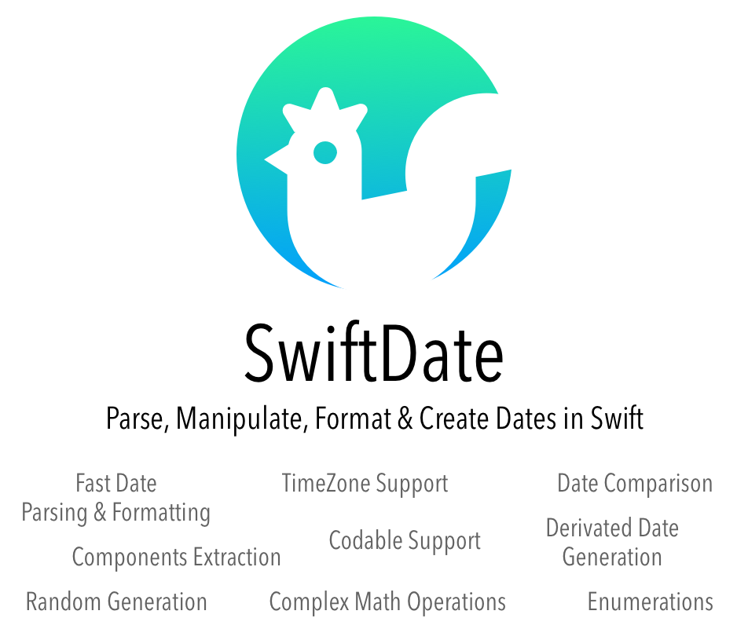

<a name="introduction"/>

- [**Index**: Table Of Contents](#Index.md)
- [**Next Chapter**: Introduction](#1.Introduction.md)

## Info & Install

- [Methods Documentation](0.Informations.md#methods)
- [Unit Tests](0.Informations.md#unittest)
- [Linux Compatibility](0.Informations.md#linux)
- [Future Plans  (ToDo List)](0.Informations.md#futureplans)
- [Communication](0.Informations.md#communication)
- [Requirements](0.Informations.md#compatibility)
- [Installation (CocoaPods,Carthage,SwiftPM](0.Informations.md#installation)
- [License](0.Informations.md#license)

<a name="methods"/>

## Methods Documentation
All methods and variables have been documented and are available for option+click inspection, just like the SDK classes. This includes an explanation of the methods as well as what their input and output parameters are for. Please raise an issue if you ever feel documentation is confusing or misleading and we will get it fixed up!

<a name="unittest"/>

## Unit Tests
Unit tests were performed on all the major classes in the library for quality assurance.
You can find theses under the "Tests" folder at the top of the library.

Currently SwiftDate has ~90$ of code coverage. 

If you ever find a test case that is incomplete, please open an issue so we can get it fixed.

<a name="futureplans"/>

<a name="linux"/>

## Linux Compatibility

Since SwiftDate 5.0.13 the package compile successfully on Linux environment with the latest Swift 4.2 snapshot.
However there is potential issue with Calendar's compare to granularity method; to know more follow the [issue #596](https://github.com/malcommac/SwiftDate/issues/568) and the radar posted on Swift's group [SR-9101](https://bugs.swift.org/browse/SR-9101).
Last Update: 2018-10-28

## Future Plans (ToDo List)

Current plans for 5.5 are:

- [x] 100% Code Coverage
- [x] Support for Recurrences support (rrule)

Any other suggestion is welcomed!

<a name="compatibility"/>

## Requirements

SwiftDate 5.x is compatible with Swift 4.x+ and the following platforms:

- iOS 9+
- macOS 10.10+
- watchOS 2.0+
- tvOS 10.0+
- any Linux platform which supports Swift 4+

<a name="communication"/>

## Communication

- If you **need help**, use [Stack Overflow](http://stackoverflow.com/questions/tagged/swiftdate). (Tag 'swiftdate')
- If you'd like to **ask a general question**, use [Stack Overflow](http://stackoverflow.com/questions/tagged/swiftdate).
- If you **found a bug**, open an issue.
- If you **have a feature request**, open an issue.
- If you **want to contribute**, submit a pull request.

<a name="installation"/>

## Installation

### CocoaPods

[CocoaPods](http://cocoapods.org) is a dependency manager for Cocoa projects. You can install it with the following command:

```bash
$ gem install cocoapods
```

> CocoaPods 1.1+ is required to build SwiftDate.

To integrate SwiftDate into your Xcode project using CocoaPods, specify it in your `Podfile`:

```ruby
source 'https://github.com/CocoaPods/Specs.git'
platform :ios, '10.0'
use_frameworks!

target '<Your Target Name>' do
pod 'SwiftDate', '~> 5.0'
end
```

Then, run the following command:

```bash
$ pod install
```

### Carthage

[Carthage](https://github.com/Carthage/Carthage) is a decentralized dependency manager that builds your dependencies and provides you with binary frameworks.

You can install Carthage with [Homebrew](http://brew.sh/) using the following command:

```bash
$ brew update
$ brew install carthage
```

To integrate SwiftDate into your Xcode project using Carthage, specify it in your `Cartfile`:

```ogdl
github "malcommac/SwiftDate" ~> 6.0
```

Run `carthage update` to build the framework and drag the built `SwiftDate.framework` into your Xcode project.

### Swift Package Manager

The [Swift Package Manager](https://swift.org/package-manager/) is a tool for automating the distribution of Swift code and is integrated into the `swift` compiler. It is in early development, but SwiftDate does support its use on supported platforms. 

Once you have your Swift package set up, adding SwiftDate as a dependency is as easy as adding it to the `dependencies` value of your `Package.swift`.

```swift
dependencies: [
.package(url: "https://github.com/malcommac/SwiftDate.git", from: "5.0.0")
]
```

<a name="license"/>

## License

SwiftDate is released under the MIT license.

The MIT License (MIT)

Copyright (c) 2018 Daniele Margutti

Permission is hereby granted, free of charge, to any person obtaining a copy
of this software and associated documentation files (the "Software"), to deal
in the Software without restriction, including without limitation the rights
to use, copy, modify, merge, publish, distribute, sublicense, and/or sell
copies of the Software, and to permit persons to whom the Software is
furnished to do so, subject to the following conditions:

The above copyright notice and this permission notice shall be included in all
copies or substantial portions of the Software.

THE SOFTWARE IS PROVIDED "AS IS", WITHOUT WARRANTY OF ANY KIND, EXPRESS OR
IMPLIED, INCLUDING BUT NOT LIMITED TO THE WARRANTIES OF MERCHANTABILITY,
FITNESS FOR A PARTICULAR PURPOSE AND NONINFRINGEMENT. IN NO EVENT SHALL THE
AUTHORS OR COPYRIGHT HOLDERS BE LIABLE FOR ANY CLAIM, DAMAGES OR OTHER
LIABILITY, WHETHER IN AN ACTION OF CONTRACT, TORT OR OTHERWISE, ARISING FROM,
OUT OF OR IN CONNECTION WITH THE SOFTWARE OR THE USE OR OTHER DEALINGS IN THE
SOFTWARE.


