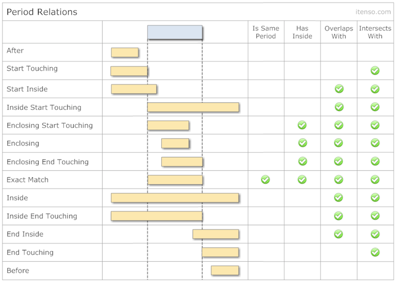
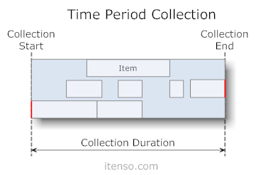
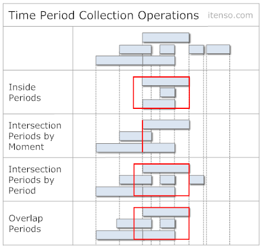
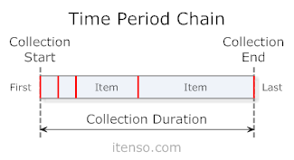
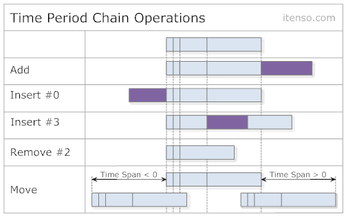

<a name="index"/>

- [**Index**: Table Of Contents](#Index.md)

## Time Periods

*NOTE: The following documentation and part of the implementation is heavely inspired by the original work of Matthew York with its [DateTools](https://github.com/MatthewYork/DateTools/) project.*

Dates are important, but the real world is a little less discrete than that. Life is made up of spans of time, like an afternoon appointment or a weeklong vacation. In DateTools, time periods are represented by the TimePeriod class and come with a suite of initializaiton, manipulation, and comparison methods to make working with them a breeze.

Time periods consist of a Date start date and end date.

```swift
let toDate = DateInRegion().dateAtStartOf(.day) // now at 00:00
let fromDate = toDate - 3.days // 3 days ago at 00:00
let period = TimePeriod(start: fromDate , end: toDate)
```

or, if you would like to create a time period of a known length that starts or ends at a certain time, try out a few other init methods.

The method below, for example, creates a time period starting at the current time that is exactly 3 days long.

```swift
let _ = TimePeriod(start: DateInRegion(), duration: 3.days)
```

## Time Period Info

A host of methods have been extended to give information about an instance of TimePeriod:

- `hasFiniteRange` - true if period has both start and end date
- `hasStart`/`hasEnd` - true if period has start/end date
- `isMoment()` - Returns true if the period has the same start and end date or the difference is between a defined range.
- `durationIn()` - Returns the length of the time period in the requested unit/s

## Manipulation

Time periods may also be manipulated. They may be shifted earlier or later as well as expanded and contracted.

### Shifting

When a time period is shifted, the start dates and end dates are both moved earlier or later by the amounts requested. To shift a time period earlier, call `. p.shifted(by:)` function with positive or negative components to shift earlier or later in time.

```swift
// Create a time period at the start of the current week and end at the end of the week
let fromDate = DateInRegion().dateAtStartOf([.weekOfYear,.day])
let toDate = fromDate.dateAtEndOf([.weekOfMonth,.day])
let thisWeek = TimePeriod(start: fromDate, end: toDate)

// Shift the period by 7 days in the future
let shiftedByOneWeek = thisWeek.shifted(by: 7.days)
```


### Lengthening/Shortening

When a time periods is lengthened or shortened, it does so anchoring one date of the time period and then changing the other one. There is also an option to anchor the centerpoint of the time period, changing both the start and end dates.

An example of lengthening a time period is shown below:

```swift
let oneMinutePeriod = TimePeriod(end: DateInRegion(), duration: 1.minutes)
let lengthed = oneMinutePeriod.lengthened(by: 1.minutes.timeInterval, at: .end)
```

This doubles a time period of duration 1 minute to duration 2 minutes. The end date of "now" is retained and only the start date is shifted 1 minute earlier.

### Relationships

There may come a need, say when you are making a scheduling app, when it might be good to know how two time periods relate to one another. Are they the same? Is one inside of another? All these questions may be asked using the relationship methods of TimePeriod.

Below is a chart of all the possible relationships between two time periods: 



A suite of methods have been extended to check for the basic relationships.
They are listed below:

- `isEqualToPeriod`
- `isInside`
- `contains`
- `overlapsWith`
- `intersects`

You can also check for the official relationship (like those shown in the chart) with the following method:

```swift
let relationship = periodA.relation(to: periodB)
```

This function returns the right value from `TimePeriodRelation` enum.

## Time Period Groups

Time period groups are the final abstraction of date and time.
Here, time periods are gathered and organized into something useful.

There are two main types of time period groups, `TimePeriodCollection` and `TimePeriodChain`. At a high level, think about a collection as a loose group where overlaps may occur and a chain a more linear, tight group where overlaps are not allowed.

Both collections and chains operate like an array. You may add, insert and remove `TimePeriod` objects from them just as you would objects in an array.

The difference is how these periods are handled under the hood.

### Time Period Collections

Time period collections serve as loose sets of time periods. They are unorganized unless you decide to sort them, and have their own characteristics like a StartDate and EndDate that are extrapolated from the time periods within. Time period collections allow overlaps within their set of time periods.



To make a new collection, call the class method like so:

```swift
// Create collection
let collection = TimePeriodCollection()
		
// Create a few time periods
let firstPeriod = TimePeriod(start: "2014-11-05 18:15:12".toDate()!, end: "2015-11-05 18:20:12".toDate()!)
let secondPeriod = TimePeriod(start: "2014-11-05 18:30:12".toDate()!, end: "2015-11-05 18:35:12".toDate()!)
collection.append([firstPeriod,secondPeriod])
```

Sorting Sorting time periods in a collection is easy, just call one of the sort methods.
Sorting can take in place (by modifying the original collection) or can return a derivated collection.
You can therefore use:

-  `sorted(by type: SortType)`: to return a collection with sorted items
- `sort(by type: SortType)`: to modify the collection in place

both of these methods takes a `SortType` enum which defines the type of sorting you can apply:

- `start(_: SortMode)`: sort by start date (`SortMode` can be `.ascending` or `.descending`)
- `end(_: SortMode)`: sort by end date (`SortMode` can be `.ascending` or `.descending`)
- `duration(_: SortMode)`: sort by duration (`SortMode` can be `.ascending` or `.descending`)
- `custom(_: ((TimePeriodProtocol, TimePeriodProtocol) -> Bool))`: sort using custom function

Operations It is also possible to check an Date's or TimePeriod's relationship to the collection.

For instance, if you would like to see all the time periods that intersect with a certain date, you can call the periodsIntersectedByDate: method. The result is a new TimePeriodCollection with all those periods that intersect the provided date. There are a host of other methods to try out as well, including a full equality check between two collections.



### Time Period Chains

Time period chains serve as a tightly coupled set of time periods.
They are always organized by start and end date, and have their own characteristics like a `start` and `end` that are extrapolated from the time periods within.
Time period chains do not allow overlaps within their set of time periods.
This type of group is ideal for modelling schedules like sequential meetings or appointments.



To make a new chain, call the class method like so:


```swift

```

Any time a date is added to the time chain, it retains its duration, but is modified to have its StartDate be the same as the latest period in the chain's EndDate. This helps keep the tightly coupled structure of the chain's time periods. Inserts (besides those at index 0) shift dates after insertion index by the duration of the new time period while leaving those at indexes before untouched. Insertions at index 0 shift the start date of the collection by the duration of the new time period. A full list of operations can be seen below.

**Operations**
Like collections, chains have an equality check and the ability to be shifted earlier and later. Here is a short list of other operations.


